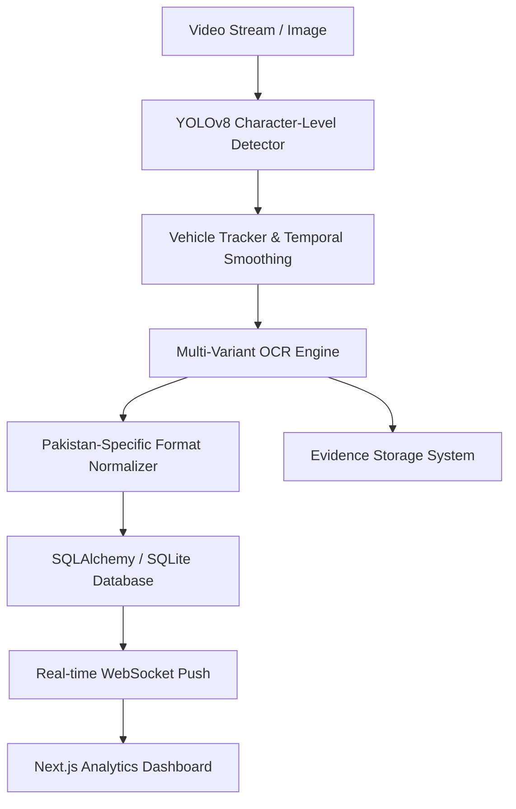

# 🚗 Pakistan ANPR: Production-Grade Automatic Number Plate Recognition
### 🎓 6th Semester DIP Project | Automated Monitoring & Enforcement System

A comprehensive, localized **Automatic Number Plate Recognition (ANPR)** system engineered for the Pakistani context. This project integrates state-of-the-art Computer Vision (YOLOv8) and Deep Learning (EasyOCR) to provide a real-time monitoring solution with a full-stack dashboard.


---

## 🏛️ System Architecture

The system follows a modular, service-oriented architecture designed for high throughput and stability.



---

## ✨ Localized Features (Pakistan Context)

Unlike generic ANPR systems, this project is fine-tuned for the unique plate formats found in Pakistan:

- **Character-Level YOLOv8 Model:** Our model detects 37 classes (A-Z, 0-9, and the plate boundary) to ensure high precision even in low lighting.
- **Punjab/Sindh Universal Series:** Built-in regex support for the latest "Smart Card" style plates (e.g., `AAA-123`, `AZ-123-456`).
- **Temporal Smoothing (Stability Fix):** Majority-voting logic ensures the "Live" detection text remains stable even if a car is moving fast or the image is vibrating.
- **Evidence Storage:** Automatically saves high-resolution crops of every detected plate in an `uploads/evidence/` folder for legal verification.
- **Dual-OCR Logic:** (Experimental) Support for fallback engines to handle the FE-Schrift font used in modern Pakistani plates.

---

## 📊 Analytics & Evaluation

The system includes a dedicated **Evaluation Service** that calculates academic performance metrics:

- **mAP (Mean Average Precision):** Evaluated against the Roboflow ANPR dataset.
- **OCR Accuracy:** Calculated via Levenshtein distance against known authorized vehicles.
- **Throughput:** Real-time FPS monitoring and per-frame latency tracking.
- **Security Audit:** Automated logging of unauthorized vehicles with timestamped photo evidence.

---

## 🚀 Quick Start

### 1. Prerequisites
- **Python 3.13** (Windows/Linux/Mac)
- **Node.js 20+**
- **Git**

### 2. Installation
```bash
# Backend
cd backend
python -m venv .venv
.\.venv\Scripts\activate
pip install -r requirements.txt

# Frontend
cd frontend
npm install
```

### 3. Execution
- **Run Backend:** `start_backend.bat` (Port 8000)
- **Run Frontend:** `start_frontend.bat` (Port 3000)

---

## 📁 Engineering Standards

- **Backend:** Clean Architecture with dependency injection (FastAPI).
- **Frontend:** Glassmorphism UI using Tailwind CSS v4 and Framer Motion.
- **State Management:** TanStack Query for high-performance data fetching.
- **Database:** SQLite with SQLAlchemy 2.x for lightweight but powerful persistence.

---

## 📊 Dataset Reference
The project utilizes a fine-tuned version of the [ANPR v4 dataset](https://universe.roboflow.com/), augmented with local Pakistani vehicle variations.
- **Training Set:** 1,146 images
- **Resolution:** 1280px (optimized for distant capture)

---

## 📄 License
This project is for academic purposes as part of the 6th Semester Digital Image Processing (DIP) curriculum. Distributed under the MIT License.

---
**Developed by Rayyan & Team | 2026**
